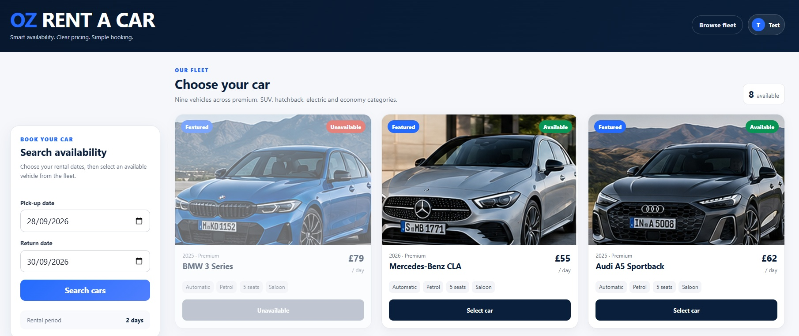

# OZ RENT A CAR

OZ Rent A Car is a responsive single-page car rental application built with React, Vite and Express.

The application provides a complete rental journey from vehicle availability search to authenticated booking confirmation and booking history.



## Features

- Search vehicle availability using pick-up and return dates
- Browse available rental vehicles
- Select a vehicle and optional extras
- Dynamic server-calculated rental quotes
- User registration and sign in
- Protected booking confirmation
- Unique booking references
- Personal booking history
- Responsive phone, tablet and desktop layouts
- Form validation and clear user feedback

## Technology

### Front End

- React
- Vite
- JavaScript
- CSS

### Back End

- Node.js
- Express
- JSON-based data storage
- Server-side authentication and booking logic

## Project Structure

```text
client/
    React/Vite front end

server/
    Express back end

server/data/cars.json
    Vehicle data

server/data/bookings.json
    Confirmed booking data

server/data/users.json
    Registered user accounts
```

The repository root also contains the shared package configuration, testing record and development notes.

## Installation

From the repository root, install the required dependencies:

```bash
npm install
```

`node_modules` should not be committed to the repository.

## Running the Application

Open two terminals in the repository root.

### Terminal 1 - Express server

```bash
npm run server
```

The API runs on:

```text
http://localhost:3000
```

### Terminal 2 - React client

```bash
npm run client
```

Open the application at:

```text
http://localhost:5173
```

Vite proxies `/api` requests from the client to the Express server.

## Booking Journey

1. Select pick-up and return dates.
2. Search for available vehicles.
3. Select an available car.
4. Choose optional extras.
5. Review the server-calculated quote.
6. Sign in or create an account.
7. Confirm the booking.
8. Receive a unique booking reference.
9. Open the account area to view confirmed bookings.

## Account and Authentication

New users can create an account using their name, email address and password.

The server validates account information and prevents duplicate email registration. Passwords are salted and hashed before storage.

Successful authentication creates a session that is used to protect booking and booking-history operations.

Only authenticated users can confirm bookings and access their personal booking history.

## Booking and Availability

Vehicle availability is checked using the selected rental dates.

The Express server is responsible for the main booking logic, including:

- availability checking
- rental duration
- vehicle pricing
- optional extras
- quote calculation
- booking creation
- booking references
- user-specific booking history

Availability is checked again when the booking is confirmed so that an earlier search result is not treated as permanent.

## Responsive Design

The interface adapts to different screen sizes.

- **Phone:** single-column booking and fleet layout
- **Tablet:** two-column vehicle grid where space allows
- **Desktop:** search panel with a three-column vehicle grid

After a vehicle is selected, the interface changes from fleet browsing to the extras and booking-review workspace.

Authentication and account views also adapt to smaller screens.

## User Experience

The interface includes:

- loading, empty and error states
- clear validation feedback
- minimum date controls
- password visibility controls
- responsive modal dialogs
- visible keyboard focus
- practical touch targets
- reduced-motion support
- printable booking confirmation
- semantic main content structure

Quote information is refreshed when the selected vehicle, dates or extras change so an outdated total cannot be confirmed.

## Testing

The application has been tested for:

- account registration
- duplicate email prevention
- valid and invalid sign in
- session behaviour
- protected booking
- vehicle availability
- dynamic quote calculation
- booking confirmation
- personal booking history
- invalid date validation
- phone, tablet and desktop layouts

See [`TESTING.md`](TESTING.md) for the detailed test record.

## Development Notes

See [`DEVELOPMENT_NOTES.md`](DEVELOPMENT_NOTES.md) for additional information about implementation decisions, iteration and project development.

---

**Ozgur Serin**
